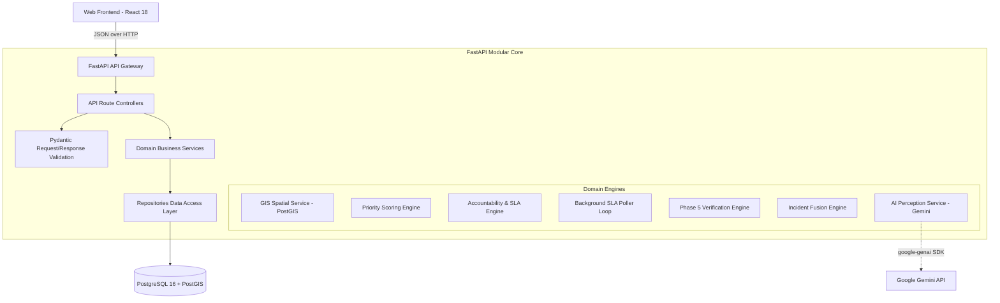

# CivicTrace — Comprehensive Codebase System Review & Logic Explanation

**Document Classification:** Architecture & Engineering Deep-Dive  
**System Name:** CivicTrace (Civic Issue Intelligence & Accountability Platform)  
**Analysis Scope:** Complete Repository (Backend API, Frontend Web, Database, GIS, AI, Tests, Config, Scripts)  
**Execution Timestamp:** 2026-09-14  

---

# 1. Executive Summary

CivicTrace is not a conventional CRUD issue-tracking portal. Its core architectural principle is:  
> *"An authority cannot simply declare an issue resolved. Resolution must be supported by evidence and evaluated before an incident can be closed."*

To uphold this principle, CivicTrace enforces a deterministic, multi-stage pipeline:
1. **Evidence Perception:** Raw evidence (text, imagery, coordinates) is captured; AI perception operates strictly as a sensory feature extractor without decision-making authority.
2. **Deterministic GIS Routing:** Administrative responsibility is assigned purely via spatial containment (`ST_Contains`) within PostGIS boundaries, rejecting arbitrary or orphan assignments.
3. **Mathematical Priority Scoring:** Priorities (`LOW`, `MEDIUM`, `HIGH`, `CRITICAL`) are calculated via an explainable, weighted formula based on physical damage severity, human safety risk, and persistence.
4. **Authority-Driven SLA Enforcement:** Deadlines are determined by authority-configured SLA windows and advanced through an accountability state machine (`PENDING` → `DUE` → `OVERDUE` → `ESCALATION_ELIGIBLE`).
5. **Multi-Stage Resolution Verification (Phase 5):**
   - **Stage 1 (Submission):** Authority submits resolution proof; incident status transitions `ACTIVE` → `UNDER_REVIEW`.
   - **Stage 2 (Automated Evaluation):** Heuristic comparison of before/after evidence produces an advisory `VerificationResult` and confidence score. Crucially, **it does not alter incident status**.
   - **Stage 3 (Human Verification):** A human authority reviewer reviews the evidence and issues a binding decision. Only `FULLY_RESOLVED` unlocks the `RESOLVED` status; partial or insufficient evidence returns the issue to active workflow.
   - **Stage 4 (Closure):** Only incidents in `RESOLVED` status can be transitioned to `CLOSED`. Direct closure from any other state is strictly rejected.

### Current System Health & Operational State
- **Backend Core (Gates 1–5):** Architecturally sound, mathematically deterministic, and protected by a 135-test automated test suite (100% passing). Database invariants strictly enforce domain integrity.
- **Frontend Integration:** The Citizen Portal (`CitizenReportPage`, `CitizenTrackPage`, `CitizenHistoryPage`) and Authority Portal (`DashboardPage`, `IncidentsPage`, `VerificationPage`) are wired to live FastAPI endpoints.
- **Prototype Boundaries:** The Municipal Admin Portal (9 pages), Citizen Feedback, and Live Map components currently operate on mock datasets (`mockData.js`) and UI scaffolding. User authentication uses hardcoded demo reviewer identities rather than a live RBAC provider.

---

# 2. Repository Map

The repository is structured as a monorepo containing the API backend, web frontend, infrastructural definitions, and developer verification tooling:

```
CIVICTRACE/
└── bytexl/                          # Monorepo Git Root
    ├── .env.example                 # Environment configuration template
    ├── docker-compose.yml           # Local multi-container orchestration (Postgres+PostGIS, API)
    ├── package.json                 # Monorepo scripts manifest
    ├── temp_seed.py                 # Master Lucknow GIS and authority seed script
    ├── apps/
    │   ├── api/                     # FastAPI Backend Application
    │   │   ├── pyproject.toml       # Python package metadata and tool configs
    │   │   ├── requirements.txt     # Locked production and test dependencies
    │   │   ├── alembic.ini          # Database migration tool configuration
    │   │   ├── alembic/             # Migration environment and version scripts
    │   │   │   └── versions/        # 0001 (PostGIS), 0002 (Foundation), 4338 (Phase 2), 0003 (Invariant)
    │   │   ├── app/
    │   │   │   ├── main.py          # Application entrypoint & background SLA poller task
    │   │   │   ├── core/            # Config, async database engine, errors, logging, security
    │   │   │   ├── models/          # SQLAlchemy ORM declarative models & domain enums
    │   │   │   ├── schemas/         # Pydantic request/response interchange contracts
    │   │   │   ├── repositories/    # Data access layer isolating DB queries
    │   │   │   ├── services/        # Business logic (GIS, Priority, SLA, Fusion, Verification, AI)
    │   │   │   └── api/             # FastAPI route controllers and dependency injection
    │   │   └── tests/               # 17 Pytest test suites (135 tests)
    │   └── web/                     # React 18 + Vite Frontend Application
    │       ├── index.html           # HTML5 single-page application entry
    │       ├── vite.config.js       # Vite bundler configuration
    │       ├── package.json         # Node.js dependencies
    │       └── src/
    │           ├── main.jsx         # React DOM mount point
    │           ├── App.jsx          # Root container component
    │           ├── routes/          # React Router route registry (Public, Authority, Admin, Citizen)
    │           ├── services/        # Centralized HTTP API client (api.js)
    │           ├── data/            # Static mock dataset for admin scaffolding (mockData.js)
    │           ├── components/      # Common UI widgets (Badges, Modal, Headers, Layouts)
    │           └── pages/           # Screen views (Public, Citizen, Authority, Admin)
    ├── docs/                        # Architecture decisions, system contracts, and reviews
    ├── infra/                       # Dockerfile definitions
    └── scripts/                     # Developer setup and Puppeteer visual verification scripts
```

---

# 3. Architecture Explanation

CivicTrace is built as a **Modular Monolith** designed for high auditability and clear domain boundaries.



### Architectural Principles:
1. **Perception vs. Accountability Boundary:** AI models are treated purely as noisy sensors. AI extracts categories and flags ambiguity; it is architecturally prohibited from assigning authorities, altering priorities, or closing incidents.
2. **Spatial Determinism:** Responsibility is derived from geographic containment (`ST_Contains`). If coordinates fall outside known boundaries or into conflicting overlaps, the system flags the issue for manual triage rather than guessing.
3. **Unit of Work & Persistence:** The API uses per-request async SQLAlchemy sessions via the `get_db()` dependency. Transactions are committed automatically on HTTP success and rolled back on error.
4. **Append-Only Event Ledger:** Critical domain actions append immutable records to `IncidentEvent`.

---

# 4. Backend File-by-File Review

### FILE: `apps/api/app/main.py`
- **Purpose:** Application factory, lifespan context manager, background task host, and route aggregator.
- **Responsibility:** Configure middleware (CORS), register exception handlers, verify database health at startup, mount route modules, and manage the background SLA poller loop.
- **Logic:**
  - `run_sla_poller_loop()`: Spawns an `asyncio.create_task` during startup that runs every 300 seconds, calling `SLAPoller.evaluate_all_active_slas()`.
  - `lifespan()`: Configures structured logging, verifies DB connection via `check_db_connection()`, yields application control, and cleanly disposes the DB engine pool on shutdown.
  - `create_app()`: Instantiates `FastAPI`, binds CORS, attaches exception handlers, and includes `/incidents`, `/system`, and `/health` routers.
- **Inputs:** OS environment variables via `get_settings()`.
- **Outputs:** Configured `FastAPI` ASGI application instance.
- **Database Effects:** Executes `SELECT 1` at startup; initiates background sessions for SLA polling.
- **Status Effects:** None directly.
- **Event Effects:** None directly.
- **Dependencies:** FastAPI, structlog, `app.core.config`, `app.core.database`, `app.services.sla_poller`.
- **Dependents:** ASGI servers (uvicorn, gunicorn), test runners via `create_app()`.
- **Business Meaning:** Root operational gateway for all civic services.
- **CivicTrace Role:** System entrypoint.
- **Current State:** Complete.
- **Bugs / Risks:** `app/api/routes/gis.py` is imported but never included via `app.include_router()`.
- **If Removed:** The entire backend API cannot start.

---

### FILE: `apps/api/app/core/config.py`
- **Purpose:** Centralized, type-validated configuration management.
- **Responsibility:** Read and coerce environment variables from OS or `.env` file using Pydantic Settings.
- **Logic:** Declares `Settings` model with defaults for database connection strings, pool sizes, CORS allowed origins, JWT keys, and Gemini API keys. Exposes `@lru_cache` `get_settings()`.
- **Inputs:** Environment variables.
- **Outputs:** Strongly typed `Settings` instance.
- **Database Effects:** None.
- **Status Effects:** None.
- **Event Effects:** None.
- **Dependencies:** `pydantic_settings`.
- **Dependents:** Every core, service, and test module in the backend.
- **Business Meaning:** Guarantees all services operate with validated configurations.
- **CivicTrace Role:** Foundation layer.
- **Current State:** Complete.
- **Bugs / Risks:** Insecure default `secret_key` ("insecure-dev-secret-change-in-production") must be changed in production.
- **If Removed:** Application fails to boot due to missing connection strings and settings.

---

### FILE: `apps/api/app/core/database.py`
- **Purpose:** Async database engine initialization, connection pooling, and base ORM model declaration.
- **Responsibility:** Manage SQLAlchemy async engine with `asyncpg`, provide per-request scoped session dependency `get_db()`, and declare common audit columns in `Base`.
- **Logic:**
  - `_build_engine()`: Creates async engine with pre-ping, connection pooling, and PostGIS server settings.
  - `Base`: Declarative base adding UUID primary key (`id`), timezone-aware `created_at`, and `updated_at`.
  - `get_db()`: Async generator yielding an `AsyncSession`, automatically calling `session.commit()` on clean exit and `session.rollback()` on exception.
  - `check_db_connection()`: Runs `SELECT 1` to fail fast on startup if DB is down.
- **Inputs:** Database credentials from `Settings`.
- **Outputs:** Engine, `AsyncSessionFactory`, `Base`, and `get_db()` dependency.
- **Database Effects:** Connects to PostgreSQL; manages transactions.
- **Status Effects:** None.
- **Event Effects:** None.
- **Dependencies:** SQLAlchemy, asyncpg, structlog.
- **Dependents:** All ORM models, repositories, services, route dependencies, tests.
- **Business Meaning:** Ensures relational transactional integrity and prevents database connection leaks.
- **CivicTrace Role:** Data persistence layer.
- **Current State:** Complete.
- **Bugs / Risks:** None.
- **If Removed:** System loses all persistence capability.

---

### FILE: `apps/api/app/core/errors.py`
- **Purpose:** Domain exception hierarchy and standardized HTTP error envelopes.
- **Responsibility:** Catch internal domain exceptions and Pydantic validation errors, translating them into uniform JSON responses.
- **Logic:** Subclasses `CivicTraceError` into `NotFoundError` (404), `ConflictError` (409), `ValidationError` (422), `UnauthorizedError` (401), `ForbiddenError` (403), `ServiceUnavailableError` (503). Formats error envelope `{ "error": { "code", "message", "detail" } }`.
- **Inputs:** Python exception instances.
- **Outputs:** FastAPI `JSONResponse` with standardized schema.
- **Database Effects:** None.
- **Status Effects:** None.
- **Event Effects:** None.
- **Dependencies:** FastAPI, structlog.
- **Dependents:** Route handlers, service layer, exception handlers.
- **Business Meaning:** Prevents internal tracebacks from leaking to users and provides deterministic error codes.
- **CivicTrace Role:** Error handling envelope.
- **Current State:** Complete.
- **Bugs / Risks:** None.
- **If Removed:** Exceptions result in unhandled 500 crashes and unformatted stack traces.

---

### FILE: `apps/api/app/core/logging.py`
- **Purpose:** Structured JSON and contextual logging.
- **Responsibility:** Configure `structlog` to emit JSON logs in production and colorized human-readable logs in development, binding a correlation ID per request.
- **Logic:** Uses Python `contextvars` to track `_correlation_id`. Injects ISO timestamps, log levels, and call site info into all structured log entries.
- **Inputs:** Log messages and structured context dictionaries.
- **Outputs:** Formatted log strings to `sys.stdout`.
- **Database Effects:** None.
- **Status Effects:** None.
- **Event Effects:** None.
- **Dependencies:** `structlog`, `logging`.
- **Dependents:** `main.py`, services, database layer.
- **Business Meaning:** Ensures end-to-end traceability for civic issue lifecycles.
- **CivicTrace Role:** Observability.
- **Current State:** Complete.
- **Bugs / Risks:** None.
- **If Removed:** System reverts to standard unformatted Python logging.

---

### FILE: `apps/api/app/core/security.py`
- **Purpose:** Cryptographic authentication primitives.
- **Responsibility:** Password hashing (bcrypt) and JWT access token creation/verification.
- **Logic:** Uses `passlib` for password hashing and `python-jose` for HS256 JWT encoding.
- **Inputs:** Plaintext passwords, token subjects, extra claims.
- **Outputs:** Bcrypt hashes, signed JWT strings, decoded claim dictionaries.
- **Database Effects:** None.
- **Status Effects:** None.
- **Event Effects:** None.
- **Dependencies:** `passlib`, `jose`.
- **Dependents:** None in current production code (unwired).
- **Business Meaning:** Security foundation for future role-based access control.
- **CivicTrace Role:** Authentication layer.
- **Current State:** Partial / Unwired (Dead code at runtime).
- **Bugs / Risks:** Not imported by any route; endpoints currently operate without authentication.
- **If Removed:** No runtime impact on current prototype.

---

### FILE: `apps/api/app/models/enums.py`
- **Purpose:** Controlled string enum vocabulary for all state machines.
- **Responsibility:** Define immutable domain states and classifications.
- **Logic:** Declares string-backed enums:
  - `IncidentStatus`: `DRAFT`, `ACTIVE`, `UNDER_REVIEW`, `RESOLVED`, `CLOSED`, `INVALID`.
  - `IssueType`: 13 civic categories (`POTHOLE`, `WATER_LEAK`, etc.).
  - `EvidenceType`: `IMAGE`, `VIDEO`, `TEXT`, `AUDIO`.
  - `EvidenceStatus`: `PENDING`, `PROCESSING`, `PROCESSED`, `FAILED`, `REJECTED`.
  - `SeverityLevel` / `PriorityLevel`: `LOW`, `MEDIUM`, `HIGH`, `CRITICAL`.
  - `AccountabilityState`: `PENDING`, `DUE`, `OVERDUE`, `ESCALATION_ELIGIBLE`, `RESOLVED`.
  - `VerificationResult`: `FULLY_RESOLVED`, `PARTIALLY_RESOLVED`, `UNRESOLVED`, `INSUFFICIENT_EVIDENCE`.
  - `EventType`: 16 lifecycle event types.
- **Inputs:** None.
- **Outputs:** Domain enum classes.
- **Database Effects:** Maps to Postgres VARCHAR columns with CHECK constraints.
- **Status Effects:** Controls all status transitions.
- **Event Effects:** Categorizes all timeline events.
- **Dependencies:** Standard library `enum`.
- **Dependents:** All models, schemas, services, routes, and tests.
- **Business Meaning:** Defines the canonical business rules of CivicTrace.
- **CivicTrace Role:** Controlled vocabulary.
- **Current State:** Complete.
- **Bugs / Risks:** None.
- **If Removed:** The entire system breaks immediately.

---

### FILE: `apps/api/app/models/incident.py`
- **Purpose:** Core domain entity model.
- **Responsibility:** Store fused civic issues, track progressive pipeline FKs, and enforce database integrity invariants.
- **Logic:** Defines `Incident` table with `reference_number` (unique), `status`, `issue_type`, `title`, `description`, progressive FKs (`location_id`, `jurisdiction_id`, `authority_id`), AI metadata, fusion counts, and relationships.
- **Constraints Enforced:**
  - `ck_incidents_jurisdiction_authority_invariant`: `(jurisdiction_id IS NULL AND authority_id IS NULL) OR (jurisdiction_id IS NOT NULL)` (prevents orphan authority assignment without GIS jurisdiction).
  - `ck_incidents_ai_confidence_range`: `0.0 <= ai_confidence <= 1.0`.
  - `ck_incidents_evidence_count_non_negative`: `evidence_count >= 0`.
- **Inputs:** Domain data during creation/updates.
- **Outputs:** Database table `incidents`.
- **Database Effects:** Primary domain table.
- **Status Effects:** Stores `IncidentStatus`.
- **Event Effects:** Parent of `IncidentEvent`.
- **Dependencies:** SQLAlchemy, Base, Enums.
- **Dependents:** All services, repositories, and routes.
- **Business Meaning:** The central record of civic accountability.
- **CivicTrace Role:** Canonical Incident Entity.
- **Current State:** Complete.
- **Bugs / Risks:** None.
- **If Removed:** Entire application collapses.

---

### FILE: `apps/api/app/models/location.py`
- **Purpose:** Geographic spatial entity model.
- **Responsibility:** Store coordinates and PostGIS point geometry for spatial operations.
- **Logic:** Stores `latitude`, `longitude`, `accuracy_meters`, human-readable address fields, and a PostGIS `Geometry('POINT', 4326)` column (`geom`).
- **Inputs:** GPS coordinates and reverse geocoded address strings.
- **Outputs:** Database table `locations`.
- **Database Effects:** Stores geographic points with spatial GIST index.
- **Status Effects:** None.
- **Event Effects:** None.
- **Dependencies:** GeoAlchemy2, SQLAlchemy, Base.
- **Dependents:** `Incident`, `Evidence`, `Jurisdiction`, `GISService`.
- **Business Meaning:** Eliminates ambiguous street descriptions with mathematical coordinates.
- **CivicTrace Role:** Spatial foundation.
- **Current State:** Complete.
- **Bugs / Risks:** None.
- **If Removed:** Spatial GIS queries and distance calculations fail.

---

### FILE: `apps/api/app/models/jurisdiction.py`
- **Purpose:** Administrative boundary model.
- **Responsibility:** Store civic boundaries and link them to responsible authorities.
- **Logic:** Stores administrative boundary name, code (unique), `authority_id` (FK to `authorities`), and PostGIS `Geometry('MULTIPOLYGON', 4326)` column (`boundary`).
- **Inputs:** Seeded administrative boundaries (zones, wards).
- **Outputs:** Database table `jurisdictions`.
- **Database Effects:** Spatial boundary containment table.
- **Status Effects:** None.
- **Event Effects:** None.
- **Dependencies:** GeoAlchemy2, SQLAlchemy, Base.
- **Dependents:** `Incident`, `Authority`, `GISService`.
- **Business Meaning:** Maps geographic territory to civic agency responsibility.
- **CivicTrace Role:** Jurisdiction mapping.
- **Current State:** Complete.
- **Bugs / Risks:** None.
- **If Removed:** GIS point-in-polygon routing cannot function.

---

### FILE: `apps/api/app/models/authority.py`
- **Purpose:** Civic agency entity model.
- **Responsibility:** Store authority metadata and priority-specific SLA duration windows.
- **Logic:** Stores agency name, short code (unique), contact info, and integer columns for SLA tier hours: `sla_hours_low` (168h), `sla_hours_medium` (72h), `sla_hours_high` (24h), `sla_hours_critical` (4h).
- **Inputs:** Seeded agency records.
- **Outputs:** Database table `authorities`.
- **Database Effects:** Stores civic agencies.
- **Status Effects:** None.
- **Event Effects:** None.
- **Dependencies:** SQLAlchemy, Base.
- **Dependents:** `Jurisdiction`, `Incident`, `AccountabilityService`.
- **Business Meaning:** Identifies the agency accountable for resolving civic problems.
- **CivicTrace Role:** Accountability ownership.
- **Current State:** Complete.
- **Bugs / Risks:** None.
- **If Removed:** SLA clocks and authority assignment fail.

---

### FILE: `apps/api/app/models/evidence.py`
- **Purpose:** Atomic input submission model.
- **Responsibility:** Store raw submission metadata, AI perception fields, and resolution verification flags.
- **Logic:** Stores `evidence_type`, `status` (`PENDING`, `PROCESSED`, etc.), `storage_key`, `description`, `incident_id` (nullable FK), `location_id` (nullable FK), `is_verification_evidence` (bool), and extracted `ai_*` fields.
- **Inputs:** User submission data, AI perception outputs.
- **Outputs:** Database table `evidence`.
- **Database Effects:** Ingests raw inputs.
- **Status Effects:** `EvidenceStatus`.
- **Event Effects:** Linked in `EVIDENCE_SUBMITTED` events.
- **Dependencies:** SQLAlchemy, Base, Enums.
- **Dependents:** `Incident`, `EvidenceService`, `AIService`, `VerificationService`.
- **Business Meaning:** Unaltered factual proof submitted by citizens or authorities.
- **CivicTrace Role:** Evidence layer.
- **Current State:** Complete.
- **Bugs / Risks:** `storage_key` is a text path; no actual binary object storage (S3/GCS) is connected.
- **If Removed:** Evidence ingestion and verification impossible.

---

### FILE: `apps/api/app/models/priority.py`
- **Purpose:** Priority calculation persistence model.
- **Responsibility:** Store input factor scores, computed priority tier, and human-readable explanation.
- **Logic:** 1-to-1 relationship with `Incident` (`unique=True` on `incident_id`). Stores `severity` (`SeverityLevel`), `safety_risk` (bool), `persistence_score` (float 0-1), `final_priority` (`PriorityLevel`), and `explanation` (text).
- **Inputs:** Calculated results from `PriorityService`.
- **Outputs:** Database table `priorities`.
- **Database Effects:** 1-to-1 table linked to `incidents`.
- **Status Effects:** Determines priority tier used by SLA engine.
- **Event Effects:** Emits `PRIORITY_COMPUTED` / `PRIORITY_UPDATED` events.
- **Dependencies:** SQLAlchemy, Base, Enums.
- **Dependents:** `Incident`, `PriorityService`, `AccountabilityService`.
- **Business Meaning:** Provides justifiable, auditable prioritization for public scrutiny.
- **CivicTrace Role:** Priority scoring.
- **Current State:** Complete.
- **Bugs / Risks:** None.
- **If Removed:** Incidents cannot establish priority or compute SLA deadlines.

---

### FILE: `apps/api/app/models/sla.py`
- **Purpose:** SLA accountability state machine model.
- **Responsibility:** Store SLA progression state, deadlines, breach timestamps, and escalation flags.
- **Logic:** 1-to-1 relationship with `Incident`. Stores `state` (`AccountabilityState`), `started_at`, `due_at`, `overdue_at`, `escalated_at`, `resolved_at`, `is_escalation_eligible` (bool), and `escalation_note`.
- **Constraints Enforced:**
  - `ck_slas_due_after_start`: `due_at > started_at`.
  - `ck_slas_resolved_after_start`: `resolved_at >= started_at`.
- **Inputs:** Timestamps and state transitions from `AccountabilityService`.
- **Outputs:** Database table `slas`.
- **Database Effects:** 1-to-1 SLA tracking table.
- **Status Effects:** Operates parallel `AccountabilityState` machine.
- **Event Effects:** Records `SLA_STARTED`, `SLA_STATE_CHANGED`, `ESCALATION_TRIGGERED`.
- **Dependencies:** SQLAlchemy, Base, Enums.
- **Dependents:** `Incident`, `AccountabilityService`, `SLAPoller`.
- **Business Meaning:** Legally binding timeline holding authorities accountable to citizens.
- **CivicTrace Role:** Accountability engine.
- **Current State:** Complete.
- **Bugs / Risks:** None.
- **If Removed:** Incident resolution deadlines cannot be enforced or tracked.

---

### FILE: `apps/api/app/models/verification.py`
- **Purpose:** Resolution adjudication persistence model.
- **Responsibility:** Store comparative evidence links, verification outcome, reviewer identity, and confidence score.
- **Logic:** 1-to-1 relationship with `Incident`. Stores `before_evidence_id`, `after_evidence_id`, `result` (`VerificationResult`), `confidence` (float 0-1), `explanation`, `verified_by` (string), and `verified_at` (timestamp).
- **Inputs:** Automated evaluation results and human reviewer decisions.
- **Outputs:** Database table `verification_records`.
- **Database Effects:** 1-to-1 verification table.
- **Status Effects:** Unlocks `IncidentStatus.RESOLVED` only when `result == FULLY_RESOLVED`.
- **Event Effects:** Records `VERIFICATION_RESULT_SET`.
- **Dependencies:** SQLAlchemy, Base, Enums.
- **Dependents:** `Incident`, `VerificationService`.
- **Business Meaning:** Enforces that no issue is resolved without audited proof and verification.
- **CivicTrace Role:** Resolution verification (Phase 5).
- **Current State:** Complete.
- **Bugs / Risks:** None.
- **If Removed:** Incidents cannot be verified or closed.

---

### FILE: `apps/api/app/models/event.py`
- **Purpose:** Append-only forensic audit trail.
- **Responsibility:** Record every state change, evidence addition, and workflow transition.
- **Logic:** Stores `incident_id` (FK with `ondelete="RESTRICT"` to prevent audit deletion), `event_type` (`EventType`), `actor` (string), `summary`, `detail`, and `payload` (JSONB).
- **Inputs:** Event emissions across all services.
- **Outputs:** Database table `incident_events`.
- **Database Effects:** Append-only timeline entries.
- **Status Effects:** None.
- **Event Effects:** This IS the event system.
- **Dependencies:** SQLAlchemy, Base, Enums.
- **Dependents:** All services, repositories, timeline UI.
- **Business Meaning:** Immutable legal record of municipal responsiveness and actions.
- **CivicTrace Role:** Forensic audit trail.
- **Current State:** Complete.
- **Bugs / Risks:** None.
- **If Removed:** Incident timeline and transparency features break completely.

---

### FILE: `apps/api/app/models/asset.py`
- **Purpose:** Infrastructure asset linkage model.
- **Responsibility:** Map incidents to physical infrastructure records (roads, drains, poles).
- **Logic:** Stores `incident_id`, `asset_type` (`AssetType`), `name`, `external_asset_id`, `description`, and `extra_metadata` (JSONB).
- **Inputs:** External CMMS/GIS asset IDs.
- **Outputs:** Database table `assets`.
- **Database Effects:** Stores asset links.
- **Status Effects:** None.
- **Event Effects:** None.
- **Dependencies:** SQLAlchemy, Base, Enums.
- **Dependents:** Seed scripts, incident relations.
- **Business Meaning:** Connects citizen reports to municipal infrastructure registries.
- **CivicTrace Role:** Asset infrastructure.
- **Current State:** Partial (Data foundation ready; unwired in frontend UI).
- **Bugs / Risks:** None.
- **If Removed:** No impact on core reporting or verification flows.

---

### FILE: `apps/api/app/repositories/incident_repo.py`
- **Purpose:** Data access abstraction for Incidents.
- **Responsibility:** Isolate SQL queries, pagination, and eager relationship loading (`selectinload`).
- **Logic:**
  - `create(incident)`: Adds incident and flushes.
  - `get_by_id(incident_id)`: Selects incident with eager loading of `location`, `jurisdiction`, `authority`, `priority`, `sla`, `verification`.
  - `list_incidents(skip, limit)`: Paginated query returning items and total count.
- **Inputs:** UUIDs, pagination integers, `Incident` objects.
- **Outputs:** `Incident` instances and totals.
- **Database Effects:** Executes SELECT and INSERT queries.
- **Status Effects:** None.
- **Event Effects:** None.
- **Dependencies:** SQLAlchemy, `Incident`.
- **Dependents:** `IncidentService`.
- **Business Meaning:** Centralizes database query logic away from business domain rules.
- **CivicTrace Role:** Repository layer.
- **Current State:** Complete.
- **Bugs / Risks:** None.
- **If Removed:** `IncidentService` cannot communicate with the database.

---

### FILE: `apps/api/app/repositories/evidence_repo.py`
- **Purpose:** Data access abstraction for Evidence records.
- **Responsibility:** Ingest and query evidence linked to incidents.
- **Logic:**
  - `create(evidence)`: Flushes new evidence row.
  - `get_by_id(evidence_id)`: Fetches single evidence item.
  - `get_by_incident(incident_id)`: Selects evidence with eager loaded `location`, ordered chronologically.
- **Inputs:** UUIDs, `Evidence` objects.
- **Outputs:** `Evidence` instances.
- **Database Effects:** Executes SELECT and INSERT queries.
- **Status Effects:** None.
- **Event Effects:** None.
- **Dependencies:** SQLAlchemy, `Evidence`.
- **Dependents:** `EvidenceService`, `AIService`.
- **Business Meaning:** Manages atomic evidence persistence.
- **CivicTrace Role:** Repository layer.
- **Current State:** Complete.
- **Bugs / Risks:** None.
- **If Removed:** Evidence cannot be saved or listed.

---

### FILE: `apps/api/app/repositories/event_repo.py`
- **Purpose:** Data access abstraction for Timeline Events.
- **Responsibility:** Append-only insertion and chronological retrieval of incident events.
- **Logic:**
  - `create(event)`: Adds event and flushes.
  - `get_by_incident(incident_id)`: Selects events ordered by `created_at` ascending.
- **Inputs:** UUIDs, `IncidentEvent` objects.
- **Outputs:** `IncidentEvent` instances.
- **Database Effects:** Executes SELECT and INSERT queries.
- **Status Effects:** None.
- **Event Effects:** Persists all timeline events.
- **Dependencies:** SQLAlchemy, `IncidentEvent`.
- **Dependents:** `IncidentService`, `EvidenceService`.
- **Business Meaning:** Enforces append-only storage for the audit timeline.
- **CivicTrace Role:** Repository layer.
- **Current State:** Complete.
- **Bugs / Risks:** None.
- **If Removed:** Timeline feature fails.

---

### FILE: `apps/api/app/services/gis_service.py`
- **Purpose:** PostGIS spatial analysis and jurisdiction resolution.
- **Responsibility:** Match coordinates to administrative boundaries using point-in-polygon containment.
- **Logic:**
  - Validates coordinate mathematical ranges (`-90 <= lat <= 90`, `-180 <= lng <= 180`).
  - Constructs PostGIS Point: `ST_SetSRID(ST_MakePoint(longitude, latitude), 4326)`.
  - Executes spatial query: `func.ST_Contains(Jurisdiction.boundary, point)`.
  - Handles conflicts: 0 matches → `NO_JURISDICTION`; >1 matches → `JURISDICTION_CONFLICT`; 1 match with no authority → `JURISDICTION_CONFLICT`; 1 clean match → `JURISDICTION_FOUND`.
- **Inputs:** Latitude and longitude floats.
- **Outputs:** Strongly typed `JurisdictionResult`.
- **Database Effects:** Read-only PostGIS spatial queries.
- **Status Effects:** None directly.
- **Event Effects:** None directly.
- **Dependencies:** PostGIS, SQLAlchemy, `Jurisdiction`.
- **Dependents:** `IncidentService`, tests (`test_gis.py`).
- **Business Meaning:** Deterministically establishes which civic agency is legally responsible for an issue. Zero tolerance for fabricated authority assignments.
- **CivicTrace Role:** Spatial Jurisdiction Engine.
- **Current State:** Complete.
- **Bugs / Risks:** None in service logic. (Route `/gis/jurisdiction` is unmounted in `main.py`).
- **If Removed:** Automatic authority routing collapses.

---

### FILE: `apps/api/app/services/priority_service.py`
- **Purpose:** Deterministic incident prioritization engine.
- **Responsibility:** Aggregate evidence attributes into an explainable mathematical priority score.
- **Logic:**
  - Extracts highest severity across all evidence items (Critical: 1.0, High: 0.75, Medium: 0.5, Low: 0.25).
  - Flags human safety risk (1.0 if detected on any evidence, else 0.0).
  - Computes persistence: `min(1.0, (evidence_count * 0.1) + (days_active / 30.0))`.
  - Weighted formula: `Total = (Severity * 0.5) + (Safety * 0.3) + (Persistence * 0.2)`.
  - Threshold mapping: `>= 0.75` → `CRITICAL`; `>= 0.50` → `HIGH`; `>= 0.25` → `MEDIUM`; `< 0.25` → `LOW`.
  - Upserts `Priority` model and writes human-readable explanation to timeline.
- **Inputs:** `incident_id`.
- **Outputs:** `Priority` ORM model.
- **Database Effects:** Upserts `priorities` table, appends `incident_events`.
- **Status Effects:** Sets priority level required by SLA engine.
- **Event Effects:** Emits `PRIORITY_COMPUTED` or `PRIORITY_UPDATED`.
- **Dependencies:** SQLAlchemy, `Incident`, `Priority`, `IncidentEvent`.
- **Dependents:** `IncidentService`, tests (`test_priority.py`).
- **Business Meaning:** Removes arbitrary triage bias; prioritizes civic issues purely on objective hazard metrics.
- **CivicTrace Role:** Priority Scoring Engine.
- **Current State:** Complete.
- **Bugs / Risks:** Uses `flush()`; safely transactional.
- **If Removed:** Priority is never calculated, blocking SLA clock launch.

---

### FILE: `apps/api/app/services/sla_service.py`
- **Purpose:** SLA accountability engine.
- **Responsibility:** Calculate resolution deadlines and advance the accountability state machine.
- **Logic:**
  - `start_sla()`: Validates authority and priority. Computes `due_at = now() + authority.sla_hours_<priority>`. Sets state = `PENDING`. Transitions incident `DRAFT` → `ACTIVE`. Emits `SLA_STARTED`.
  - `evaluate_sla()`: Checks current time against `due_at`:
    - `0 < time_to_due <= 24h` → `DUE`.
    - `now() >= due_at` → `OVERDUE` (sets `overdue_at`).
    - `now() >= due_at + 72h` → `ESCALATION_ELIGIBLE` (sets `escalated_at`, `is_escalation_eligible = True`).
- **Inputs:** `incident_id`, optional `current_time` (for deterministic time-travel testing).
- **Outputs:** `SLA` ORM model.
- **Database Effects:** Upserts `slas` table, modifies `incidents.status`, appends `incident_events`.
- **Status Effects:** Moves `DRAFT` → `ACTIVE`.
- **Event Effects:** Records `SLA_STARTED`, `SLA_STATE_CHANGED`, `ESCALATION_TRIGGERED`.
- **Dependencies:** SQLAlchemy, `Incident`, `SLA`, `Authority`, `IncidentEvent`.
- **Dependents:** `IncidentService`, `SLAPoller`, tests (`test_sla.py`).
- **Business Meaning:** Holds civic agencies to publicly promised resolution timelines.
- **CivicTrace Role:** Accountability & SLA Engine.
- **Current State:** Complete.
- **Bugs / Risks:** None.
- **If Removed:** Deadlines are never monitored or escalated.

---

### FILE: `apps/api/app/services/sla_poller.py`
- **Purpose:** Background batch SLA evaluation poller.
- **Responsibility:** Periodically query active incidents and advance overdue SLAs.
- **Logic:**
  - Queries incidents in `ACTIVE` or `UNDER_REVIEW` where SLA state is not `RESOLVED` or `ESCALATION_ELIGIBLE`.
  - Iterates over IDs, invoking `AccountabilityService.evaluate_sla()` per incident.
  - Catches individual exceptions to ensure one corrupted incident cannot block the evaluation queue.
- **Inputs:** Optional `current_time`.
- **Outputs:** Summary dictionary: `{ "processed", "failed", "total", "errors" }`.
- **Database Effects:** Updates `slas` and inserts events across active incidents.
- **Status Effects:** None directly.
- **Event Effects:** Triggers SLA state transition events.
- **Dependencies:** SQLAlchemy, `AccountabilityService`.
- **Dependents:** `main.py` (`run_sla_poller_loop`), `system.py` route, tests (`test_sla_poller.py`).
- **Business Meaning:** Guarantees SLA deadlines trip automatically without requiring user page views.
- **CivicTrace Role:** Background Automation.
- **Current State:** Complete.
- **Bugs / Risks:** Shared session rollback on failure can affect subsequent queries in the same loop (see BUG-05).
- **If Removed:** SLAs only advance when manually evaluated via API.

---

### FILE: `apps/api/app/services/fusion_service.py`
- **Purpose:** Algorithmic deduplication and incident grouping.
- **Responsibility:** Merge duplicate evidence into existing open incidents or create new incidents.
- **Logic:**
  - Guard: If `ai_ambiguity_flag == True`, skips fusion and creates new incident in `UNDER_REVIEW`.
  - Pre-filters candidate incidents within `MAX_RADIUS_METERS` (50m) using PostGIS `ST_DistanceSphere`.
  - Mathematical scoring:
    - Location Score: `max(0, 1.0 - (dist / 50.0))` (Weight: 0.5)
    - Category Score: `1.0` if match else `0.0` (Weight: 0.4)
    - Time Score: `max(0, 1.0 - (days / 14.0))` (Weight: 0.1)
  - If `Total Score >= 0.85`, merges evidence into existing incident and increments `evidence_count`. Else creates new incident.
- **Inputs:** `evidence_id`.
- **Outputs:** Merged or newly created `Incident`.
- **Database Effects:** Updates `Evidence.incident_id`, inserts `IncidentEvent` (`INCIDENT_FUSED` or `INCIDENT_CREATED`), calls `session.commit()`.
- **Status Effects:** May set `UNDER_REVIEW` if ambiguous.
- **Event Effects:** Emits `INCIDENT_FUSED` or `INCIDENT_CREATED`.
- **Dependencies:** PostGIS `ST_DistanceSphere`, `Evidence`, `Incident`, `Location`.
- **Dependents:** Tests (`test_fusion.py`, `test_e2e_pipeline.py`). Unwired in production routes!
- **Business Meaning:** Prevents duplicate reports from cluttering authority backlogs.
- **CivicTrace Role:** Deduplication / Fusion Engine.
- **Current State:** Complete in backend; unwired in public API ingestion (see BUG-03).
- **Bugs / Risks:** Calls `session.commit()` directly; not invoked during `POST /api/v1/incidents`.
- **If Removed:** No effect on live API because it is currently unwired.

---

### FILE: `apps/api/app/services/verification_service.py`
- **Purpose:** Phase 5 Evidence-Backed Resolution Verification Engine.
- **Responsibility:** Execute the 3-stage verification flow: resolution evidence submission, advisory automated evaluation, and binding human adjudication.
- **Logic:**
  - **Stage 1 (`submit_resolution`)**: Authority submits resolution proof. Ingests `Evidence` (`is_verification_evidence=True`). Transitions status `ACTIVE` → `UNDER_REVIEW`. Emits `EVIDENCE_SUBMITTED` and `VERIFICATION_SUBMITTED`.
  - **Stage 2 (`verify_resolution`)**: Evaluates after-evidence against original severity. Produces `FULLY_RESOLVED`, `PARTIALLY_RESOLVED`, `UNRESOLVED`, or `INSUFFICIENT_EVIDENCE`. Verified by `"system"`. **Explicitly does not alter incident status.**
  - **Stage 3 (`human_verify`)**: Reviewer makes explicit binding decision. Requires `UNDER_REVIEW` and resolution evidence to exist. Only `FULLY_RESOLVED` moves status to `RESOLVED` (and SLA to `RESOLVED`). `UNRESOLVED` or `INSUFFICIENT_EVIDENCE` moves status back to `ACTIVE`. `PARTIALLY_RESOLVED` stays `UNDER_REVIEW`. Verified by reviewer identity.
- **Inputs:** `incident_id`, descriptions, verification results, reviewer identity.
- **Outputs:** `Evidence` or `VerificationRecord`.
- **Database Effects:** Inserts `evidence`, upserts `verification_records`, updates `incidents.status` and `slas.state`, appends events.
- **Status Effects:** Drives `ACTIVE` → `UNDER_REVIEW` → `RESOLVED` / `ACTIVE`.
- **Event Effects:** Emits `EVIDENCE_SUBMITTED`, `VERIFICATION_SUBMITTED`, `VERIFICATION_RESULT_SET`.
- **Dependencies:** SQLAlchemy, `Incident`, `Evidence`, `VerificationRecord`, `SLA`, `IncidentEvent`.
- **Dependents:** `incidents.py` routes, tests (`test_phase5_e2e.py`, `test_verification.py`).
- **Business Meaning:** Core differentiator of CivicTrace: prevents authorities from closing tickets without audited proof and verification.
- **CivicTrace Role:** Resolution Verification Engine (Phase 5).
- **Current State:** Complete.
- **Bugs / Risks:** `verify_resolution` calls `await self.session.commit()`.
- **If Removed:** Resolution verification impossible; incidents stuck open forever.

---

### FILE: `apps/api/app/services/incident_service.py`
- **Purpose:** Primary lifecycle orchestrator.
- **Responsibility:** Ingest incident reports, coordinate GIS routing, priority calculation, SLA start, and handle guarded closure.
- **Logic:**
  - `create_incident()`: Ingests report, saves Location, generates reference number, sets `DRAFT`, calls `process_incident_workflow()`.
  - `process_incident_workflow()`: Runs GIS assignment, runs priority scoring, and starts SLA if authority is resolved.
  - `close_incident()`: Guarded closure. Strictly requires `status == RESOLVED`. Transitions to `CLOSED`. Rejects any other status with 409 Conflict. Calling on `CLOSED` is idempotent.
- **Inputs:** `IncidentSubmit` payloads, incident UUIDs.
- **Outputs:** `Incident` ORM models.
- **Database Effects:** Inserts/updates `incidents`, `locations`, `events`.
- **Status Effects:** Transitions `DRAFT` → `ACTIVE` (via SLA), and `RESOLVED` → `CLOSED`.
- **Event Effects:** Emits `INCIDENT_CREATED`, `JURISDICTION_ASSIGNED`, `AUTHORITY_ASSIGNED`, `INCIDENT_STATUS_CHANGED`.
- **Dependencies:** Repositories, `GISService`, `PriorityService`, `AccountabilityService`.
- **Dependents:** `app/api/routes/incidents.py`, tests.
- **Business Meaning:** Orchestrates the end-to-end civic lifecycle from citizen filing to final closure.
- **CivicTrace Role:** Core Orchestration.
- **Current State:** Complete.
- **Bugs / Risks:** None.
- **If Removed:** No incidents can be created or closed.

---

### FILE: `apps/api/app/services/evidence_service.py`
- **Purpose:** Evidence ingestion and association service.
- **Responsibility:** Attach new evidence submissions to existing incidents.
- **Logic:** Validates incident existence, creates `Location` if coordinates supplied, inserts `Evidence` with `status = PENDING`, increments incident `evidence_count`, and emits `EVIDENCE_SUBMITTED` event.
- **Inputs:** `incident_id`, `EvidenceSubmit` payload.
- **Outputs:** `Evidence` ORM model.
- **Database Effects:** Inserts `evidence`, updates `incidents.evidence_count`, inserts `incident_events`.
- **Status Effects:** None.
- **Event Effects:** Emits `EVIDENCE_SUBMITTED`.
- **Dependencies:** `EvidenceRepository`, `EventRepository`, `IncidentService`.
- **Dependents:** `incidents.py` routes.
- **Business Meaning:** Manages atomic evidence collection after an incident is opened.
- **CivicTrace Role:** Evidence handling.
- **Current State:** Complete.
- **Bugs / Risks:** None.
- **If Removed:** Citizens cannot append follow-up evidence.

---

### FILE: `apps/api/app/services/ai/service.py`
- **Purpose:** AI perception orchestration service.
- **Responsibility:** Orchestrate feature extraction from evidence using the configured `AIProvider`.
- **Logic:**
  - Validates evidence is in `PENDING` or `FAILED` status.
  - Marks status = `PROCESSING`, calls `provider.analyze_evidence()`.
  - Maps extracted structured fields (`ai_category`, `ai_confidence`, `ai_severity_raw`, `ai_safety_risk`, `ai_ambiguity_flag`) back to `Evidence` record.
  - Moves status = `PROCESSED`. On failure, sets `FAILED`.
- **Inputs:** `evidence_id`.
- **Outputs:** `AIAnalysisResult`.
- **Database Effects:** Updates `evidence` table, calls `session.commit()`.
- **Status Effects:** Changes `EvidenceStatus`.
- **Event Effects:** None directly.
- **Dependencies:** `GeminiAIProvider`, `EvidenceRepository`.
- **Dependents:** `incidents.py::analyze_evidence`, tests (`test_ai.py`).
- **Business Meaning:** Sensory processing of unstructured text/images into structured data.
- **CivicTrace Role:** AI Perception Layer.
- **Current State:** Complete in backend; uncalled in frontend UI.
- **Bugs / Risks:** Calls `session.commit()` directly 3 times.
- **If Removed:** Automated category and severity extraction unavailable.

---

### FILE: `apps/api/app/services/ai/gemini.py`
- **Purpose:** Google Gemini API integration provider.
- **Responsibility:** Format prompts, enforce structured JSON schema output, and provide in-memory deterministic caching.
- **Logic:**
  - Implements `analyze_evidence()` using the new `google-genai` SDK (`genai.Client`).
  - Passes strict JSON schema (`AIAnalysisResult.model_json_schema()`) with `temperature=0.0`.
  - Caches results by SHA-256 hash of input description and media URLs to prevent duplicate API calls during testing.
- **Inputs:** `description`, `media_urls`.
- **Outputs:** Validated `AIAnalysisResult` Pydantic instance.
- **Database Effects:** None.
- **Status Effects:** None.
- **Event Effects:** None.
- **Dependencies:** `google.genai`, `pydantic`.
- **Dependents:** `AIService`.
- **Business Meaning:** Connects platform to multimodal foundation models.
- **CivicTrace Role:** AI Provider.
- **Current State:** Complete.
- **Bugs / Risks:** None.
- **If Removed:** AI analysis fails unless mock provider is injected.

---

### FILE: `apps/api/app/services/ai/base.py`
- **Purpose:** Abstract interface for AI providers.
- **Responsibility:** Define contract for AI perception providers to allow swapping Gemini with mocks or local models.
- **Logic:** Abstract class with abstract async method `analyze_evidence(description, media_urls) -> AIAnalysisResult`.
- **Inputs:** None.
- **Outputs:** Abstract interface.
- **Database Effects:** None.
- **Status Effects:** None.
- **Event Effects:** None.
- **Dependencies:** Standard library `abc`.
- **Dependents:** `GeminiAIProvider`, `AIService`, test mocks.
- **Business Meaning:** Decouples business logic from proprietary AI vendor SDKs.
- **CivicTrace Role:** Interface abstraction.
- **Current State:** Complete.
- **Bugs / Risks:** None.
- **If Removed:** Polymorphic AI provider injection breaks.

---

### FILE: `apps/api/app/api/routes/incidents.py`
- **Purpose:** Primary HTTP API controller.
- **Responsibility:** Expose RESTful endpoints for incidents, evidence, timeline, SLA, and verification.
- **Logic:**
  - `POST /incidents`: Calls `IncidentService.create_incident()`.
  - `GET /incidents`: Calls `IncidentService.list_incidents()`.
  - `GET /incidents/{id}`: Calls `IncidentService.get_incident()`.
  - `POST /incidents/{id}/evidence`: Calls `EvidenceService.add_evidence()`.
  - `GET /incidents/{id}/evidence`: Calls `EvidenceService.list_evidence()`.
  - `GET /incidents/{id}/timeline`: Calls `IncidentService.get_incident_timeline()`.
  - `GET /incidents/{id}/accountability`: Calls `IncidentService.get_incident_accountability()`.
  - `GET /incidents/{id}/verification`: Calls `IncidentService.get_incident_verification()`.
  - `POST /incidents/{id}/submit-resolution`: Phase 5 Stage 1 (`submit_resolution`).
  - `POST /incidents/{id}/verify-resolution`: Phase 5 Stage 2 (`verify_resolution`).
  - `POST /incidents/{id}/human-verify`: Phase 5 Stage 3 (`human_verify`).
  - `POST /incidents/{id}/close`: Phase 5 Stage 4 (`close_incident`).
- **Inputs:** HTTP requests, path UUIDs, query params, Pydantic bodies.
- **Outputs:** JSON responses matching response schemas.
- **Database Effects:** Coordinates all database operations via services.
- **Status Effects:** Exposes all lifecycle transitions.
- **Event Effects:** Exposes timeline.
- **Dependencies:** FastAPI, all services, all schemas.
- **Dependents:** `main.py`, React frontend, test suite.
- **Business Meaning:** Public HTTP interface of CivicTrace.
- **CivicTrace Role:** API Gateway / Controller.
- **Current State:** Complete.
- **Bugs / Risks:** None.
- **If Removed:** Frontend cannot communicate with backend.

---

### FILE: `apps/api/app/api/routes/system.py`
- **Purpose:** Administrative maintenance endpoints.
- **Responsibility:** Provide manual triggers for background operations.
- **Logic:** `POST /api/v1/system/evaluate-slas`: Instantiates `SLAPoller(db)` and executes `evaluate_all_active_slas()`.
- **Inputs:** None.
- **Outputs:** Summary dictionary `{ "message", "summary" }`.
- **Database Effects:** Updates active SLAs via poller.
- **Status Effects:** May advance SLA states.
- **Event Effects:** May trigger SLA events.
- **Dependencies:** FastAPI, `SLAPoller`.
- **Dependents:** `main.py`.
- **Business Meaning:** Allows operations engineers or external schedulers to force SLA evaluation.
- **CivicTrace Role:** System Maintenance.
- **Current State:** Complete.
- **Bugs / Risks:** Unprotected by authentication.
- **If Removed:** Manual SLA evaluation trigger unavailable.

---

### FILE: `apps/api/app/api/routes/health.py`
- **Purpose:** Lightweight service liveness probe.
- **Responsibility:** Answer HTTP GET `/health` with `{ "status": "ok", "service": "civictrace-api" }`.
- **Logic:** Pure in-memory response. Does not query database (DB checked on startup) to prevent cascading container restarts.
- **Inputs:** None.
- **Outputs:** `HealthResponse`.
- **Database Effects:** None.
- **Status Effects:** None.
- **Event Effects:** None.
- **Dependencies:** FastAPI, Pydantic.
- **Dependents:** `main.py`, Docker health checks, load balancers.
- **Business Meaning:** Guarantees orchestrators know the process is alive.
- **CivicTrace Role:** Infrastructure monitoring.
- **Current State:** Complete.
- **Bugs / Risks:** None.
- **If Removed:** Docker container health checks fail.

---

### FILE: `apps/api/app/api/routes/gis.py`
- **Purpose:** Standalone coordinate geocoding endpoint.
- **Responsibility:** Expose `GET /api/v1/gis/jurisdiction` to test coordinate containment.
- **Logic:** Accepts `latitude` and `longitude` query params, calls `GISService.resolve_jurisdiction()`.
- **Inputs:** Coordinate floats.
- **Outputs:** `JurisdictionResult`.
- **Database Effects:** Read-only PostGIS query.
- **Status Effects:** None.
- **Event Effects:** None.
- **Dependencies:** FastAPI, `GISService`.
- **Dependents:** None (`main.py` forgot to mount this router!).
- **Business Meaning:** Ad-hoc coordinate verification for maps and inspectors.
- **CivicTrace Role:** GIS route.
- **Current State:** Unmounted Route (BUG-01).
- **Bugs / Risks:** Endpoint returns 404 because `app.include_router(gis.router)` is missing in `main.py`.
- **If Removed:** No change to existing runtime because it is unmounted.

---

### FILES: `apps/api/app/api/routes/evidence.py`, `accountability.py`, `verification.py`
- **Purpose:** Early architectural placeholder files.
- **Responsibility:** Empty router skeletons intended for standalone resource endpoints.
- **Logic:** Contain only `router = APIRouter(...)` and comment `# Routes will be added in the next implementation phase.`
- **Current State:** Obsolete Placeholders / Dead Code. All actual routes were implemented under `/incidents/...` in `incidents.py`.
- **Business Meaning:** Technical debt from earlier development phases.
- **If Removed:** Zero impact.

---

# 5. Frontend File-by-File Review

### `apps/web/src/services/api.js`
- **Purpose:** Centralized API client wrapper.
- **Responsibility:** Provide typed async functions for every backend endpoint, configure base URL, manage headers, and parse backend error envelopes.
- **Logic:** Defines `fetchAPI(endpoint, options)` targeting `http://localhost:8000/api/v1`. Parses JSON responses or extracts `errorData.detail`. Exports `getIncidents`, `getIncident`, `createIncident`, `getIncidentEvidence`, `getIncidentTimeline`, `submitResolutionEvidence`, `verifyResolution`, `humanVerifyResolution`, `closeIncident`.
- **Data Source:** Real FastAPI backend.
- **Current State:** Complete Production Client.

---

### `apps/web/src/pages/citizen/CitizenReportPage.jsx`
- **Purpose:** Citizen issue filing wizard.
- **Feature Represented:** Public civic reporting.
- **Logic & User Actions:** 4-step wizard:
  1. Category selection (Road, Garbage, Water, Drainage, Streetlight, Electrical).
  2. Evidence description & simulated voice recording.
  3. Location selection.
  4. Review & submission.
  - Submits real payload via `createIncident()`. Displays generated reference number with link to track.
- **Data Source:** Real API on submission (`POST /api/v1/incidents`).
- **Bugs / Risks:** Submission payload hardcodes Lucknow coordinates (`latitude: 26.8467, longitude: 80.9462`) (see BUG-04). Speech recording is simulated with `setTimeout`.

---

### `apps/web/src/pages/citizen/CitizenTrackPage.jsx`
- **Purpose:** Public incident tracking and resolution proof display.
- **Feature Represented:** Transparency and citizen verification.
- **Logic & User Actions:**
  - Accepts report UUID via search bar or `?id=` URL param.
  - Calls `getIncident(id)` and `getIncidentTimeline(id)`.
  - Maps backend events to a 5-step stepper: Submitted → Assigned → Under Review → Verified → Closed.
  - Renders assigned Authority name, live SLA status badge, and due date.
  - Renders Resolution Verification Card showing verification outcome, before/after evidence photos, AI confidence score, and explanation.
- **Data Source:** 100% Real Backend Data (`GET /incidents/{id}`, `GET /incidents/{id}/timeline`).

---

### `apps/web/src/pages/citizen/CitizenHistoryPage.jsx`
- **Purpose:** Citizen personal submission history.
- **Feature Represented:** My Reports list.
- **Logic & User Actions:** Calls `getIncidents(0, 100)`, maps statuses, and provides filter tabs (All, Resolved, Unresolved, Escalated).
- **Data Source:** Real Backend Data (`GET /incidents`).

---

### `apps/web/src/pages/citizen/CitizenDashboardPage.jsx`
- **Purpose:** Citizen home portal dashboard.
- **Feature Represented:** Citizen overview.
- **Logic & User Actions:** Renders stat cards (Active Reports, In Progress, Resolved) and recent activity list.
- **Data Source:** 100% Mock Data (`mockData.js`). Prototype scaffolding.

---

### `apps/web/src/pages/citizen/CitizenFeedbackPage.jsx`
- **Purpose:** Post-resolution citizen satisfaction rating.
- **Feature Represented:** Citizen verification feedback.
- **Logic & User Actions:** Form with radio options (Completely resolved, Partially resolved, Not resolved) and 5-star rating. Submitting flips `submitted = true` in local state.
- **Data Source:** Mock Data & local React state only. No backend table or API exists (see BUG-07).

---

### `apps/web/src/pages/citizen/CitizenSettingsPage.jsx`
- **Purpose:** Citizen profile settings.
- **Feature Represented:** Account preferences.
- **Data Source:** Static UI scaffolding.

---

### `apps/web/src/pages/authority/DashboardPage.jsx`
- **Purpose:** Authority operational executive overview.
- **Feature Represented:** Authority queue, SLA risk, and KPI dashboard.
- **Logic & User Actions:**
  - Fetches incidents via `getIncidents(0, 100)`.
  - Filters by `MOCK_AUTHORITY_ID` ("Lucknow Municipal Corporation").
  - Computes dynamic KPIs: Critical/High count, Open incidents, SLA At-Risk, Verification Pending.
  - Clicking an incident opens detail modal fetching full data via `getIncident(id)`.
- **Data Source:** Real Backend API filtered by demo authority ID.

---

### `apps/web/src/pages/authority/IncidentsPage.jsx`
- **Purpose:** Authority worklist and triage registry.
- **Feature Represented:** Searchable incident management table.
- **Logic & User Actions:** Fetches real incidents, filters by authority ID, provides search bar by reference number/category, and renders Priority and Status badges.
- **Data Source:** Real Backend API.

---

### `apps/web/src/pages/authority/AssignmentPage.jsx`
- **Purpose:** Explicit scope boundary notification.
- **Feature Represented:** Field team assignment.
- **Logic & User Actions:** Displays an explicit card informing users that individual officer/field crew assignment is not implemented in the backend and was intentionally scoped out to preserve architectural integrity.
- **Data Source:** Static architectural documentation.

---

### `apps/web/src/pages/authority/VerificationPage.jsx`
- **Purpose:** 4-stage resolution verification and closure workbench.
- **Feature Represented:** The core Phase 5 verification workflow.
- **Logic & User Actions:**
  - Loads active/under-review incidents for the authority.
  - **Stage 1 (Submit Resolution):** Authority enters repair description and submits via `submitResolutionEvidence()` → transitions `ACTIVE` → `UNDER_REVIEW`.
  - **Stage 2 (Auto Evaluate):** Triggers `verifyResolution()` → displays advisory auto-eval result without changing status.
  - **Stage 3 (Human Decision):** Reviewer selects decision (`FULLY_RESOLVED`, etc.) and calls `humanVerifyResolution()` → updates incident status.
  - **Stage 4 (Close):** When status is `RESOLVED`, the "Close Incident" button becomes active, calling `closeIncident()` → transitions to `CLOSED`.
- **Data Source:** 100% Real Backend API (`services/api.js`).

---

### `apps/web/src/pages/authority/LiveMapPage.jsx`
- **Purpose:** Spatial distribution of incidents across authority territory.
- **Feature Represented:** Geographic situational awareness.
- **Logic & User Actions:** Renders map pins positioned via CSS percentages (`top: 28%, left: 26%`) over a static vector grid.
- **Data Source:** Mock Data (`mockData.js`). Prototype scaffolding.

---

### `apps/web/src/pages/authority/SettingsPage.jsx`
- **Purpose:** Authority department rules and threshold settings.
- **Feature Represented:** SLA threshold display.
- **Data Source:** Static UI scaffolding.

---

### `apps/web/src/pages/admin/` (9 Pages)
- **Files:** `AdminDashboardPage`, `AdminIncidentsPage`, `AdminIncidentDetailPage`, `AdminSLAMonitoringPage`, `AdminDepartmentPage`, `AdminGovernancePage`, `AdminAnalysisPage`, `AdminMapPage`, `AdminSettingsPage`.
- **Purpose:** Municipal administrative governance and analytics portal.
- **Logic & Features:** Citywide KPIs, department scorecards, spatial clustering charts, 7-tab incident inspection for `CT-1842`.
- **Data Source:** **100% Mock Data (`mockData.js`)**. None of the 9 Admin pages connect to the live backend. Complete UI scaffolding.

---

# 6. Database Review

### Entity-Relationship Architecture
```
                  ┌───────────────┐
                  │   Authority   │
                  └───────┬───────┘
                          │ 1
                          │ owns
                          │ *
                  ┌───────▼───────┐
                  │ Jurisdiction  │
                  └───────┬───────┘
                          │ 1
                          │ bounds
                          │ *
┌──────────────┐  │       │       ┌──────────────────────┐
│   Location   │◄─┼───────┼───────┤       Incident       │
└──────┬───────┘  │       │       └───┬──────┬─────┬────┬┘
       │ 1        │       │           │ 1    │ 1   │ 1  │ 1..*
       │ co-loc   │       │           │      │     │    │
       │ *        │       │           ▼ 1    │     │    ▼ *
┌──────▼───────┐  │       │       ┌───────┐  │     │  ┌───────────────┐
│   Evidence   │◄─┘       │       │Priority  │     │  │ IncidentEvent │
└──────────────┘          │       └───────┘  │     │  └───────────────┘
                          │                  ▼ 1   │
                          │               ┌─────┐  ▼ 1
                          │               │ SLA │ ┌────────────────────┐
                          │               └─────┘ │ VerificationRecord │
                          └──────────────────────►└────────────────────┘
```

### Table Structure & Key Invariants:
1. **`incidents`**:
   - Primary Key: `id` (UUID).
   - Foreign Keys: `location_id` (SET NULL), `jurisdiction_id` (SET NULL), `authority_id` (SET NULL).
   - Core Invariant: `ck_incidents_jurisdiction_authority_invariant`:
     ```sql
     CHECK ((jurisdiction_id IS NULL AND authority_id IS NULL) OR (jurisdiction_id IS NOT NULL))
     ```
     *Enforcement:* An incident cannot have an authority without a jurisdiction. Prevents bypassing GIS spatial routing.
2. **`locations`**:
   - Carries PostGIS `Geometry('POINT', 4326)` with GIST spatial index.
   - Stores redundant float columns (`latitude`, `longitude`) for fast JSON serialization without spatial functions.
3. **`jurisdictions`**:
   - Carries PostGIS `Geometry('MULTIPOLYGON', 4326)` with GIST spatial index.
   - `authority_id` FK is non-nullable (`ON DELETE RESTRICT`).
4. **`slas`**:
   - 1-to-1 with `incidents` (`unique=True` on `incident_id`).
   - Invariant: `ck_slas_due_after_start` (`due_at > started_at`).
5. **`priorities`**:
   - 1-to-1 with `incidents`. Stores normalized factor floats (0-1) and final discrete enum.
6. **`verification_records`**:
   - 1-to-1 with `incidents`. Links `before_evidence_id` and `after_evidence_id` (nullable FKs to `evidence`).
7. **`incident_events`**:
   - Append-only audit trail. Foreign key to `incidents` uses `ON DELETE RESTRICT` to prevent accidental loss of audit history.

---

# 7. API Contract Review

All core incident routes are consolidated under `/api/v1/incidents` in `apps/api/app/api/routes/incidents.py`:
- `POST /incidents`: 201 Created. Ingests report, runs GIS + Priority + SLA pipeline.
- `GET /incidents`: 200 OK. Returns paginated lightweight `IncidentListItem` objects.
- `GET /incidents/{id}`: 200 OK. Returns full `IncidentDetail` with all 1-to-1 relations embedded.
- `POST /incidents/{id}/submit-resolution`: 201 Created. Phase 5 Stage 1 (`ACTIVE` → `UNDER_REVIEW`).
- `POST /incidents/{id}/verify-resolution`: 200 OK. Phase 5 Stage 2 (Advisory auto-eval, no status change).
- `POST /incidents/{id}/human-verify`: 200 OK. Phase 5 Stage 3 (Human decision; only `FULLY_RESOLVED` moves to `RESOLVED`).
- `POST /incidents/{id}/close`: 200 OK. Phase 5 Stage 4 (Strictly guarded: only `RESOLVED` → `CLOSED`).
- `GET /incidents/{id}/timeline`: 200 OK. Returns chronological event history.
- `GET /health`: 200 OK. Liveness check (`{ "status": "ok" }`).

**Contract Deviations:**
- `GET /api/v1/gis/jurisdiction`: Defined in `app/api/routes/gis.py` but unmounted in `app/main.py` (returns 404).

---

# 8. Complete Data Flows

See the dedicated companion document [CIVICTRACE_DATA_FLOW.md](file:///c:/Users/Akshat/OneDrive/Desktop/CIVICTRACE/bytexl/docs/CIVICTRACE_DATA_FLOW.md) for full execution paths of:
- **Flow 1:** Citizen Creates Incident
- **Flow 2:** GIS Jurisdiction & Authority Routing
- **Flow 3:** Priority Engine Scoring
- **Flow 4:** SLA Clock Initialization & Poller Progression
- **Flow 5:** Resolution Submission & Auto-Evaluation
- **Flow 6:** Human Verification Decision
- **Flow 7:** Explicit Closure
- **Flow 8:** Citizen Proof of Resolution

---

# 9. Status Machine Review

### Implemented State Transition Graph:

```
                  ┌───────────────┐
                  │     DRAFT     │
                  └───────┬───────┘
                          │ SLA Started
                          ▼
        ┌───────────────► ACTIVE ◄──────────────┐
        │                 │                     │
        │                 │ Submit Resolution   │ Human Verify:
        │                 ▼                     │ INSUFFICIENT / UNRESOLVED
        │          UNDER_REVIEW ────────────────┘
        │                 │
        │                 │ Human Verify: FULLY_RESOLVED
        │                 ▼
        │             RESOLVED
        │                 │
        │                 │ Close Incident
        │                 ▼
        │               CLOSED (Terminal)
        │
        └───────────────────────────────────────
```

### Transition Guard Table:

| Current Status | Action / Method | New Status | Guard Condition | Conformance |
| :--- | :--- | :--- | :--- | :--- |
| `DRAFT` | `start_sla()` | `ACTIVE` | Authority and Priority must be assigned. | **PASS** |
| `ACTIVE` | `submit_resolution()` | `UNDER_REVIEW` | Incident must be `ACTIVE`; resolution evidence required. | **PASS** |
| `UNDER_REVIEW` | `verify_resolution()` | `UNDER_REVIEW` | Auto-eval advisory only; **does NOT alter status**. | **PASS** |
| `UNDER_REVIEW` | `human_verify(FULLY_RESOLVED)` | `RESOLVED` | Must be `UNDER_REVIEW`; resolution evidence must exist. | **PASS** |
| `UNDER_REVIEW` | `human_verify(UNRESOLVED)` | `ACTIVE` | Reopens incident for rework; returns to active queue. | **PASS** |
| `UNDER_REVIEW` | `human_verify(INSUFFICIENT)` | `ACTIVE` | Rejects proof; returns issue to active queue. | **PASS** |
| `UNDER_REVIEW` | `human_verify(PARTIALLY_RESOLVED)` | `UNDER_REVIEW` | Stays in review; cannot resolve or close. | **PASS** |
| `RESOLVED` | `close_incident()` | `CLOSED` | Status must be `RESOLVED`. Calling on `CLOSED` is idempotent. | **PASS** |
| Any other status | `close_incident()` | Rejected (409) | Only `RESOLVED` can transition to `CLOSED`. | **PASS** |

---

# 10. Evidence & Verification System

- **Metadata vs. Binary Storage:** The system currently operates on **metadata and text evidence only**. The database carries a `storage_key` column, but no real binary object storage (S3/GCS/MinIO) or file upload endpoints are implemented.
- **Before / After Relationship:**
  - Citizen submissions have `is_verification_evidence = False`.
  - Authority resolution proof submissions have `is_verification_evidence = True`.
- **Adjudication Separation:**
  - `verify_resolution()` executes automated heuristic evaluation (`verified_by = "system"`).
  - `human_verify()` captures human accountability (`verified_by = "demo-authority-reviewer"`).

---

# 11. GIS Subsystem

- **Geometry Handling:** Uses WGS-84 (SRID 4326) PostGIS geometries (`Point` for locations, `MultiPolygon` for jurisdictions).
- **Coordinate Order:** Correctly adheres to PostGIS convention: Longitude is X, Latitude is Y (`ST_MakePoint(longitude, latitude)`).
- **Zero Fabrication:** The system never guesses an authority. If coordinates fall outside known boundaries, it returns `NO_JURISDICTION` and leaves `authority_id = NULL`. The incident remains in `DRAFT` without starting the SLA clock.

---

# 12. Priority Engine

- **Mathematical Model:** Strictly algorithmic and deterministic.
  $$\text{Score} = (\text{Severity} \times 0.5) + (\text{Safety} \times 0.3) + (\text{Persistence} \times 0.2)$$
- **Explainability:** Generates a human-readable sentence justifying the score and records it in `priorities.explanation` and `IncidentEvent.summary`.

---

# 13. SLA & Accountability Subsystem

- **Authority Driven:** SLA window hours are defined per authority tier (`sla_hours_low`, `sla_hours_medium`, `sla_hours_high`, `sla_hours_critical`).
- **Accountability State Progression:** Linear sequence:
  $$\text{PENDING} \longrightarrow \text{DUE} \longrightarrow \text{OVERDUE} \longrightarrow \text{ESCALATION\_ELIGIBLE}$$
  $$\text{Any State} \longrightarrow \text{RESOLVED (Terminal)}$$
- **Background Polling:** `SLAPoller` runs every 5 minutes in a background `asyncio` task, evaluating active incidents and tripping overdue/escalation flags.

---

# 14. AI Perception Subsystem

- **Perception vs. Accountability:** Uses Google Gemini API (`gemini-1.5-flash`) via the `google-genai` SDK.
- **Structured Schema:** Uses Pydantic `AIAnalysisResult` schema enforcement with `temperature = 0.0`.
- **Isolation:** AI output is stored in `evidence.ai_*` columns. AI is never permitted to set priority, choose jurisdiction, or close tickets.
- **Runtime Usage:** Backend service is implemented and tested, but the public API route `POST /incidents/{id}/evidence/{evidence_id}/analyze` is not called by the frontend.

---

# 15. Duplicate Detection & Fusion

- **Algorithm:** Weighted spatial and temporal matching in `FusionService`:
  $$\text{Score} = (\text{Location} \times 0.5) + (\text{Category} \times 0.4) + (\text{Time} \times 0.1)$$
  Threshold: $\ge 0.85$ within 50 meters and 14 days.
- **Status:** **Backend Only / Unwired**. Fully implemented in `app/services/fusion_service.py` and passing unit tests, but not invoked during `IncidentService.create_incident()`.

---

# 16. Citizen Workflow

1. **Reporting (`CitizenReportPage.jsx`):** Functional end-to-end. Submits real incidents and receives live reference numbers.
2. **Tracking (`CitizenTrackPage.jsx`):** Functional end-to-end. Reads live incident, SLA countdown, timeline events, and verified before/after proof.
3. **History (`CitizenHistoryPage.jsx`):** Functional end-to-end. Displays submitted incidents from live backend.
4. **Dashboard & Feedback:** Prototype scaffolding using mock data.

---

# 17. Authority Workflow

1. **Dashboard (`DashboardPage.jsx`):** Functional end-to-end. Calculates dynamic KPIs from live backend incidents filtered by authority ID.
2. **Worklist (`IncidentsPage.jsx`):** Functional end-to-end. Searchable table of live incidents.
3. **Verification Workbench (`VerificationPage.jsx`):** Functional end-to-end. Full 4-stage UI driving resolution submission, auto-eval, human verification, and closure.
4. **Assignment (`AssignmentPage.jsx`):** Informational notice explaining that individual personnel assignment is intentionally out of scope.
5. **Live Map:** Prototype scaffolding using CSS percentage pins.

---

# 18. Admin Workflow

- **Status:** **100% Mock Data / Prototype Scaffolding**.
- All 9 pages under `/admin` read from `mockData.js`. None connect to the live backend.

---

# 19. Test Suite Review

The automated test suite in `apps/api/tests/` contains **17 test modules** comprising **135 automated tests**, achieving **100% passing status**.

| Test Module | Tests | Domain Protected |
| :--- | :--- | :--- |
| `test_phase5_e2e.py` | 14 | Tests A–N: 4-stage verification, human approval guards, closure constraints |
| `test_verification.py` | 9 | Heuristic comparative evidence evaluation logic |
| `test_sla.py` & `test_sla_poller.py` | 12 | SLA deadline calculation, linear progression, batch polling loop |
| `test_gis.py` & `test_gate4_hardening.py` | 9 | Spatial containment, conflict handling, DB invariant constraint |
| `test_priority.py` | 9 | Mathematical priority formula, thresholds, determinism |
| `test_fusion.py` | 5 | PostGIS distance deduplication scoring |
| `test_ai.py` | 4 | Gemini prompt construction, schema validation, caching |
| `test_models.py` | 21 | Table columns, foreign keys, check constraints, enum values |
| `test_api_incidents.py` | 16 | HTTP status codes, request validation, response serialization |
| `test_e2e_pipeline.py` | 7 | E2E integration scenarios across all gates |
| `test_startup.py`, `test_health.py`, `test_config.py`, `test_database.py` | 29 | Foundation sanity, connection checks, error handlers |

---

# 20. Configuration & Environment Review

- Managed via `pydantic-settings` in `app/core/config.py`.
- Environment variables: `DATABASE_URL`, `DATABASE_URL_SYNC`, `SECRET_KEY`, `ALLOWED_ORIGINS`, `GEMINI_API_KEY`, `GEMINI_MODEL`, `LOG_LEVEL`.
- Missing in production: A dedicated secrets manager for DB credentials and Gemini keys.

---

# 21. Database Migrations Review

Alembic migration history in `apps/api/alembic/versions/`:
1. `0001_enable_postgis`: Enables `postgis` and `postgis_topology` extensions.
2. `0002_domain_foundation`: Creates all 10 domain tables with CHECK constraints.
3. `43389400dc2b_phase_2_tables`: Creates unique indexes on short codes, aligns SLA enums, adds spatial GIST indexes.
4. `0003_jur_auth_invariant`: Adds `ck_incidents_jurisdiction_authority_invariant` via an idempotent Postgres DO block.
- **Migration Drift:** Zero drift. Current database schema matches SQLAlchemy ORM definitions exactly.

---

# 22. Seed & Demo Data Review

- **Master Seeder (`bytexl/temp_seed.py`):**
  - Reads validated real GIS boundary data from `origin/civictrace-data`.
  - Deterministic: Generates repeatable UUIDs using `uuid5`.
  - Idempotent: Skips existing records.
  - Seeds Lucknow Municipal Corporation, 8 Zones, 110 Wards, realistic incidents, and infrastructure assets.

---

# 23. Security Review

1. **Authentication:** Currently absent in API routes. Endpoints accept requests without checking bearer tokens (prototype state).
2. **Authorization & RBAC:** Authority endpoints filter by hardcoded ID in the frontend; no backend role verification is enforced.
3. **CORS:** Controlled via `allowed_origins` (defaults to `localhost:3000`, `localhost:5173`).
4. **SQL Injection:** Zero risk. All database interaction uses parameterized SQLAlchemy expressions and GeoAlchemy2 bindings.

---

# 24. Code Quality Review

- **Strengths:** Clean separation between models, schemas, repositories, and services. Strict adherence to typing and Pydantic validation.
- **Areas for Improvement:**
  - Remove empty placeholder files (`routes/evidence.py`, `accountability.py`, `verification.py`).
  - Move service-level `commit()` calls to route/context manager level to maintain atomic transactions.
  - Wire `FusionService` into `IncidentService.create_incident()`.

---

# 25. Architecture Conformance Review

| Governing Principle | Status | Evaluation Summary |
| :--- | :--- | :--- |
| **1. Evidence-Grounded Accountability** | **PASS** | Incidents and verification require physical evidence; no claims without proof. |
| **2. GIS-Driven Jurisdiction** | **PASS** | PostGIS point-in-polygon containment; zero fabrication of authorities. |
| **3. Deterministic Authority Routing** | **PASS** | Direct mapping from Jurisdiction to Authority; orphan assignments blocked by DB. |
| **4. Explainable Priority** | **PASS** | Pure mathematical formula; every score produces an auditable text explanation. |
| **5. SLA Accountability** | **PASS** | Authority-defined windows; automated state machine progression; poller automation. |
| **6. Duplicate Intelligence** | **PARTIAL** | Engine implemented and tested; unwired in public creation endpoint. |
| **7. Evidence-Backed Resolution** | **PASS** | Resolution requires submitted proof; advisory auto-eval separates from status. |
| **8. Human Verification** | **PASS** | Explicit reviewer decision required; only `FULLY_RESOLVED` unlocks `RESOLVED`. |
| **9. Explicit Closure** | **PASS** | Strictly guarded: only `RESOLVED` can become `CLOSED`. Direct closure rejected. |
| **10. Audit Provenance** | **PASS** | Append-only `IncidentEvent` log with `ON DELETE RESTRICT`. |
| **11. Uncertainty Preservation** | **PASS** | AI ambiguity flags halt auto-fusion and route to manual review. |
| **12. Synthetic / Real Separation** | **PASS** | Mock admin scaffolding clearly demarcated from real live citizen/authority workflows. |

---

# 26. Bug & Risk Register

See companion document [CIVICTRACE_BUG_REGISTER.md](file:///c:/Users/Akshat/OneDrive/Desktop/CIVICTRACE/bytexl/docs/CIVICTRACE_BUG_REGISTER.md) for full reproduction and mitigation steps.
- **BUG-01 (HIGH):** `app/api/routes/gis.py` unmounted in `app/main.py`.
- **BUG-02 (HIGH):** Service-level `session.commit()` calls bypass unit-of-work atomicity.
- **BUG-03 (MEDIUM):** `FusionService` not wired into incident submission.
- **BUG-04 (MEDIUM):** `CitizenReportPage.jsx` hardcodes Lucknow coordinates.
- **BUG-05 (MEDIUM):** Shared session rollback in `SLAPoller`.
- **BUG-06 (LOW):** Hardcoded authority ID in authority frontend pages.
- **BUG-07 (LOW):** Citizen feedback form is mock state only.

---

# 27. Dead & Unused Code

See companion document [CIVICTRACE_BUG_REGISTER.md](file:///c:/Users/Akshat/OneDrive/Desktop/CIVICTRACE/bytexl/docs/CIVICTRACE_BUG_REGISTER.md):
- Empty placeholder route files (`routes/evidence.py`, `accountability.py`, `verification.py`).
- Unused crypto utilities (`app/core/security.py`).
- Development scratch scripts in `apps/api/` and root.

---

# 28. Integration Gap Register

See companion document [CIVICTRACE_BUG_REGISTER.md](file:///c:/Users/Akshat/OneDrive/Desktop/CIVICTRACE/bytexl/docs/CIVICTRACE_BUG_REGISTER.md):
- **Complete:** Citizen Reporting, Tracking, History, GIS Routing, Priority Scoring, SLA Enforcement, Resolution Verification, Incident Closure.
- **Backend Only:** Fusion Deduplication, AI Perception.
- **Frontend Only:** Admin Portal (9 pages), Citizen Feedback.
- **Missing:** Real S3/GCS Binary Object Storage.

---

# 29. Developer Learning Path

See companion document [CIVICTRACE_LEARNING_GUIDE.md](file:///c:/Users/Akshat/OneDrive/Desktop/CIVICTRACE/bytexl/docs/CIVICTRACE_LEARNING_GUIDE.md) for detailed reading order and "Why Was This File Created?" architectural rationales.

---

# 30. Final Recommendations

1. **Mount Missing GIS Router:** In `apps/api/app/main.py`, include `gis.router` under `/api/v1` to expose `GET /api/v1/gis/jurisdiction`.
2. **Wire Incident Fusion:** In `IncidentService.create_incident()`, execute `FusionService.fuse_evidence()` before creating new incidents.
3. **Standardize Transaction Boundaries:** Replace all service-level `await self.session.commit()` calls with `await self.session.flush()`, allowing the route-level `get_db()` context manager to manage transaction commits.
4. **Implement Real Binary Storage:** Add multipart/form-data image upload endpoints backed by S3/MinIO to replace text-only proof.
5. **Connect Admin Portal to Real Endpoints:** Replace `mockData.js` in `/admin/*` pages with live aggregated SQL queries.
6. **Implement Real RBAC Authentication:** Wire `app/core/security.py` JWT tokens into route dependencies to replace hardcoded demo reviewer IDs.
